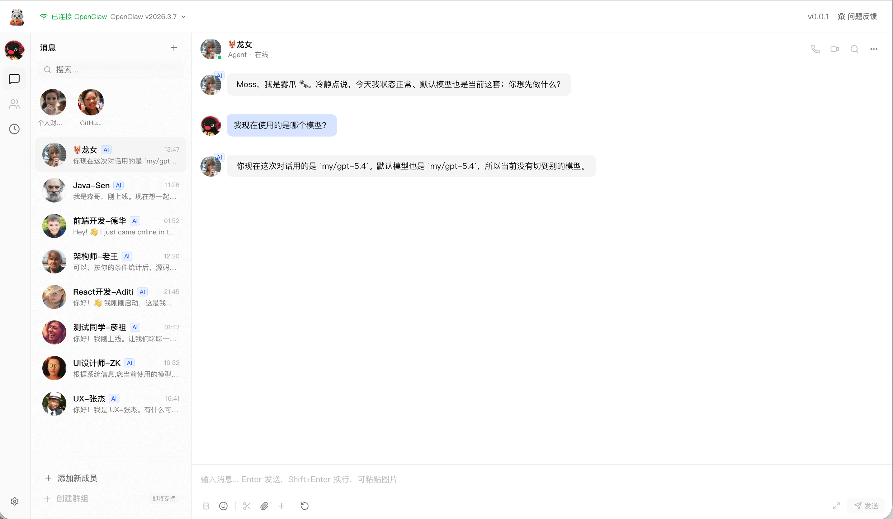
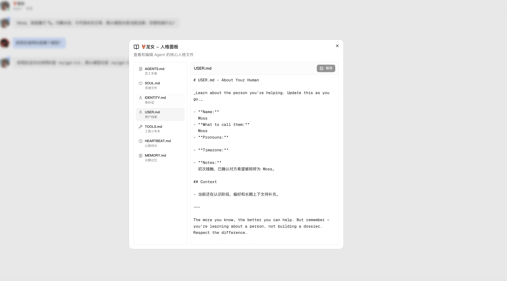
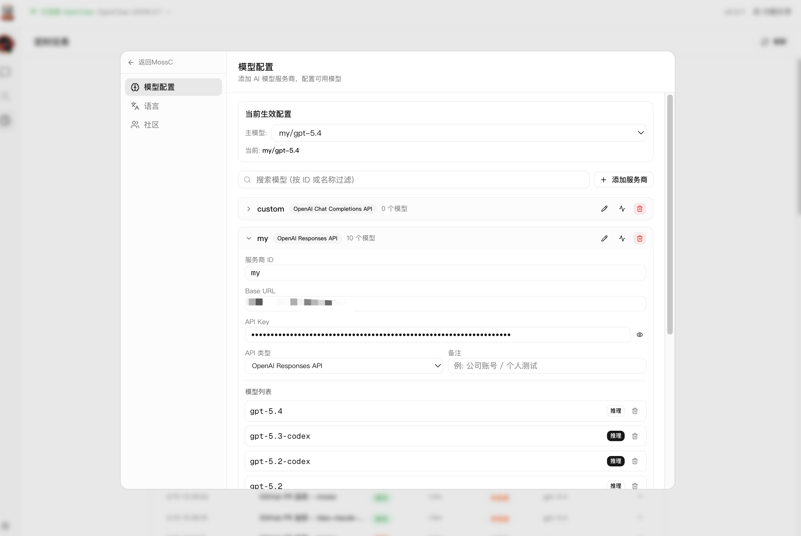

<div align="center">

# MossC（Moss Company）


[English](./README.md) · **简体中文**

![][github-contributors-shield] ![][github-forks-shield] ![][github-stars-shield] ![][github-issues-shield]

</div>

**MossC** 的目标是打造一个AI公司，99%的决策都由AI进行；

> 目前已经支持OpenClaw Agent，未来还将支持Claude Code，Codex等智能体；目前还在迭代中，目前阶段更像OpenClaw的一个UI层优化，但是这不是终点，我的想法还是打造一个AI公司，OpenClaw只是其中的一类AI员工



---

### 如何使用

#### 环境要求

- Node.js >= 18
- pnpm >= 8

#### 安装与启动

```bash
# 1. 克隆仓库
git clone https://github.com/zhukunpenglinyutong/mossc.git
cd mossc

# 2. 安装依赖
pnpm install

# 3. 启动开发服务器
pnpm dev
```

启动后访问 http://localhost:3000 即可打开 MossC 界面。

#### 连接 OpenClaw

MossC 依赖 [OpenClaw](https://github.com/anthropics/openclaw) 作为底层 AI Agent 引擎，需要先部署并启动 OpenClaw 服务：

1. 按照 OpenClaw 文档完成部署与启动
2. 打开 MossC 页面，进入 **设置 → 模型配置**，填入 OpenClaw Gateway 地址和 Token
3. 如果 OpenClaw 运行在本地，MossC 会自动从 `~/.openclaw/openclaw.json` 读取连接配置，无需手动填写

#### 生产构建

```bash
pnpm build
pnpm start
```

---

### 功能介绍

##### 基础对话功能


##### Agent 人格面板：编辑与查看



##### 模型配置功能



##### 创建Agent功能


##### Agent 置顶功能


---

### 迭代计划

v0.1：优化OpenClaw交互细节，往AI公司交互方向上发展；优化OpenClaw部署流程和配置指引
v0.2：开放群组功能 并提供移动端，客户端，docker等方式使用
v0.3：开放claude code，codex等，实现OpenClaw 与 其他AI个体 混用
v0.4：深入研究自我迭代方向以及集成更多OpenClaw工具或者方案
v0.5：思考中...

---

### License

[MIT](https://github.com/zhukunpenglinyutong/mossc?tab=MIT-1-ov-file)

---

## Star History

[](https://www.star-history.com/#zhukunpenglinyutong/mossc&type=date&legend=top-left)

<!-- LINK GROUP -->

[github-contributors-shield]: https://img.shields.io/github/contributors/zhukunpenglinyutong/mossc?color=c4f042&labelColor=black&style=flat-square
[github-forks-shield]: https://img.shields.io/github/forks/zhukunpenglinyutong/mossc?color=8ae8ff&labelColor=black&style=flat-square
[github-issues-link]: https://github.com/zhukunpenglinyutong/mossc/issues
[github-issues-shield]: https://img.shields.io/github/issues/zhukunpenglinyutong/mossc?color=ff80eb&labelColor=black&style=flat-square
[github-license-link]: https://github.com/zhukunpenglinyutong/mossc/blob/main/LICENSE
[github-stars-shield]: https://img.shields.io/github/stars/zhukunpenglinyutong/mossc?color=ffcb47&labelColor=black&style=flat-square
